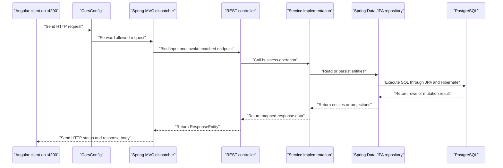
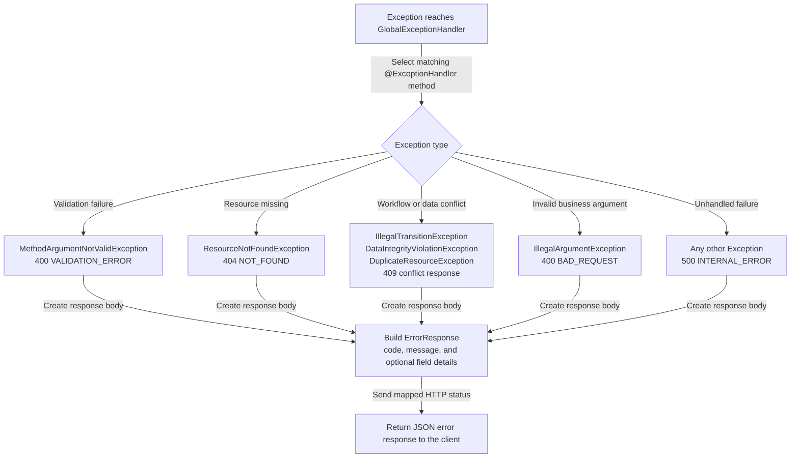

# Request Flow

These diagrams describe how an HTTP request moves through the Spring Boot backend. `CorsConfig` allows requests from the Angular development client at `http://localhost:4200`.

## Layered request flow

```mermaid
flowchart LR
    Client["Angular client on http://localhost:4200"]
    Cors["CORS handling<br/>CorsConfig.java<br/>Allows localhost:4200 and configured HTTP methods"]
    Dispatcher["Spring MVC dispatcher and route matching<br/>Selects the controller from request mappings"]
    Binding["Request binding and validation<br/>Deserializes DTOs and applies Jakarta validation"]
    Controller["REST controller<br/>Receives request DTOs and returns ResponseEntity"]
    Service["Service implementation<br/>Applies business rules, workflows, and mapping"]
    Repository["Spring Data JPA repository"]
    Database[("PostgreSQL")]
    Handler["GlobalExceptionHandler<br/>Maps validation, business, data,<br/>and unexpected exceptions to ErrorResponse"]

    Client -->|"HTTP request"| Cors
    Cors -->|"Forward allowed request"| Dispatcher
    Dispatcher -->|"Bind request parameters or body"| Binding
    Binding -->|"Invoke matched endpoint"| Controller
    Controller -->|"Invokes business operation"| Service
    Service -->|"Reads or writes entities"| Repository
    Repository -->|"Executes SQL through JPA and Hibernate"| Database
    Database -->|"Returns query or mutation result"| Repository
    Repository -->|"Returns entities or projections"| Service
    Service -->|"Returns response data"| Controller
    Controller -->|"Return response body and status"| Dispatcher
    Dispatcher -->|"HTTP response"| Client

    Binding -.->|"Propagates validation exceptions"| Handler
    Controller -.->|"Propagates controller exceptions"| Handler
    Service -.->|"Propagates business exceptions"| Handler
    Repository -.->|"Propagates data-access exceptions"| Handler
    Handler -->|"Returns structured ErrorResponse"| Dispatcher
```

## Successful request sequence

## Exception response flow

`GlobalExceptionHandler` converts exceptions propagated from request processing into the shared `ErrorResponse` envelope.

