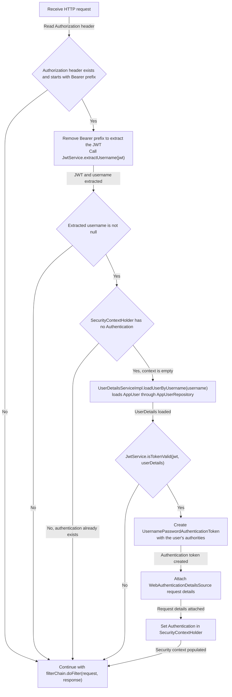
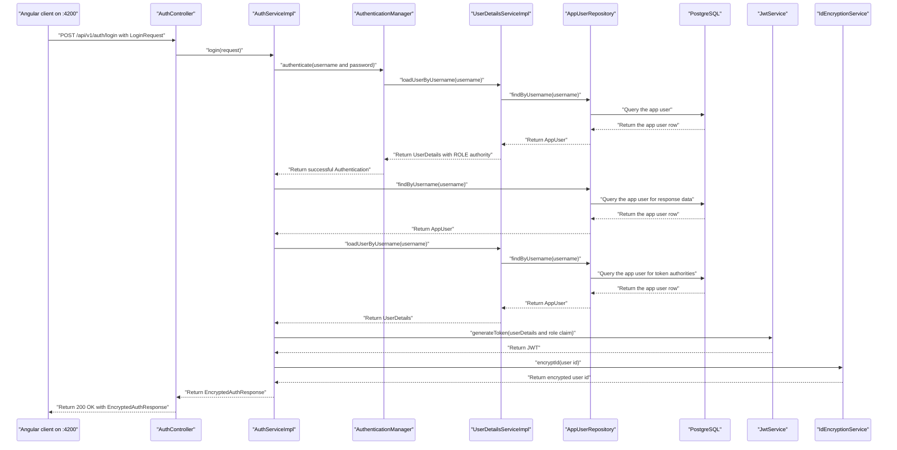

# Request Flow

These diagrams describe the request path implemented by the Spring Boot backend. The browser origin allowed by `CorsConfig` is `http://localhost:4200`, and authentication is stateless: each protected request is authorized from its JWT rather than an HTTP session.

## Layered request flow

```mermaid
flowchart LR
    Client["Angular client on http://localhost:4200"]
    Cors["CORS handling<br/>CorsConfig.java<br/>Allows localhost:4200, configured methods, all headers, and credentials"]
    Jwt["JWT authentication filter<br/>JwtAuthenticationFilter.doFilterInternal"]
    Rules["SecurityFilterChain URL rules<br/>POST /api/v1/auth/login: public<br/>Swagger and OpenAPI: public<br/>/api/v1/users/**: ADMIN only<br/>/api/v1/reports/**: ADMIN or SUPERVISOR<br/>/api/v1/dashboard/**: authenticated<br/>All other requests: authenticated"]
    Controller["REST controller<br/>Method-level authorization with @PreAuthorize<br/>Examples: dashboard my-open-cases is HANDLER only;<br/>case transitions allow HANDLER, SUPERVISOR, or ADMIN"]
    Service["Service layer<br/>Business rules and workflows"]
    Repository["Spring Data JPA repository"]
    Database[("PostgreSQL")]
    Handler["GlobalExceptionHandler<br/>Maps validation, authentication, authorization,<br/>business, data, and unexpected exceptions to ErrorResponse"]

    Client -->|"HTTP request"| Cors
    Cors -->|"CORS-approved request"| Jwt
    Jwt -->|"Request with any established Authentication"| Rules
    Rules -->|"URL rule permits request"| Controller
    Rules -->|"Rejects an unauthenticated or unauthorized request"| Client
    Controller -->|"Invokes business operation"| Service
    Service -->|"Reads or writes entities"| Repository
    Repository -->|"Executes SQL through JPA and Hibernate"| Database
    Database -->|"Returns query or mutation result"| Repository
    Repository -->|"Returns entities or projections"| Service
    Service -->|"Returns response data"| Controller
    Controller -->|"Returns HTTP response"| Client

    Controller -.->|"Propagates controller exceptions"| Handler
    Service -.->|"Propagates business exceptions"| Handler
    Repository -.->|"Propagates data-access exceptions"| Handler
    Handler -->|"Returns structured error response"| Client
```

The URL rules above come from `SecurityConfig.securityFilterChain`. Controller and service `@PreAuthorize` checks can narrow access further after the URL-level rule admits the request.

## JWT authentication decision flow

This flow follows `JwtAuthenticationFilter.doFilterInternal`. Regardless of whether authentication is established, the request continues to the remaining filter chain unless token processing throws an exception.

## Login sequence

`POST /api/v1/auth/login` is explicitly public in `SecurityConfig`; the credentials are authenticated inside `AuthServiceImpl`. The repository is queried while the authentication provider loads the user and again while the service builds the response.

Invalid credentials, disabled accounts, and other propagated failures are converted to API error responses by `GlobalExceptionHandler`.
